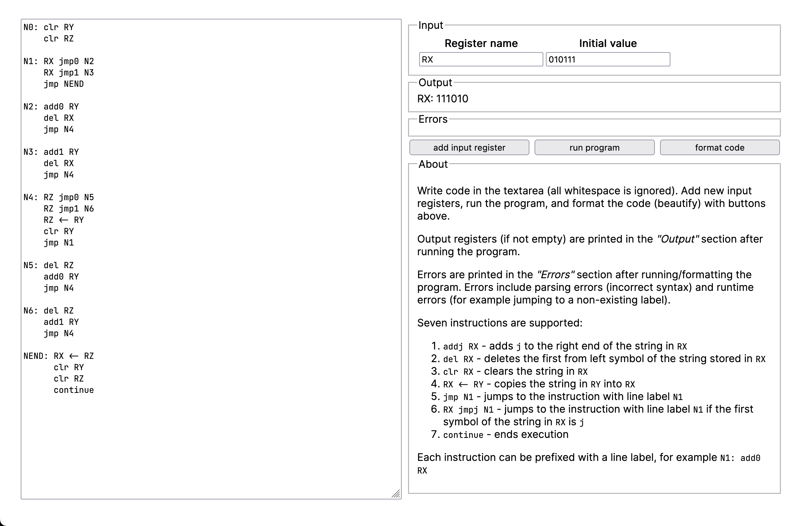

# Random-access machine runner

[](https://github.com/shilangyu/ram-machine/actions)

A simple Rust [RAM](https://en.wikipedia.org/wiki/Random-access_machine) program runner.

- Lexer/Parser
- Program executor
- Code formatter

## Web

Compiled to WASM to run in the browser. Features a simple textarea for code and UI for interacting with the program executor. Live at [https://github.shilangyu.dev/ram-runner](https://github.shilangyu.dev/ram-runner).



## CLI

Once compiled run against a file containing RAM code and some initial registers. Output will show the final state of all non-empty registers. Example:

```console
$ cargo build --release
$ ./target/release/ram rev.ram RX=1011100010101
RX: 1010100011101
```
